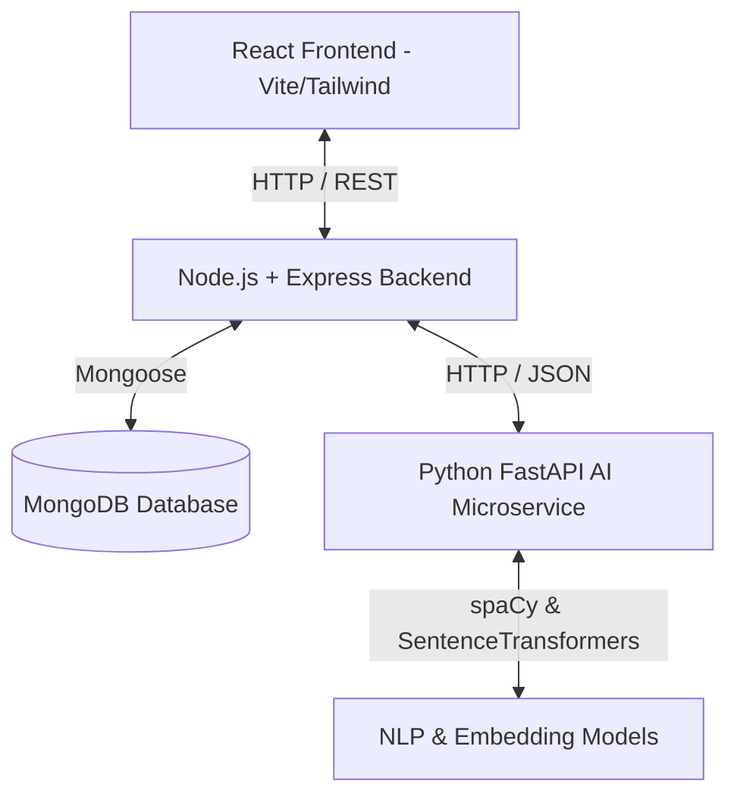

# AI-Powered Resume Analyzer

A production-ready full-stack application designed to analyze resumes using AI/NLP, calculate ATS compatibility scores, match resumes with job descriptions, identify skill gaps, generate tailored interview questions, predict career roles, and suggest targeted certifications.

This project is structured as a multi-service system comprising a React frontend, a Node.js/Express backend API gateway, and a Python FastAPI AI microservice.

---

## 1. Project Abstract & Problem Statement

### Abstract
In the modern job market, HR departments utilize Application Tracking Systems (ATS) to filter through thousands of resumes daily. Many qualified candidates are rejected due to formatting issues, missing keywords, or mismatched layouts that are poorly parsed by ATS algorithms. The **AI-Powered Resume Analyzer** resolves this gap by offering job seekers an intelligent tool to evaluate, optimize, and align their resumes for specific job descriptions. By integrating advanced Natural Language Processing (NLP) models, spaCy-based keyword extractors, and sentence embedding models, this system evaluates resumes, provides actionable section-wise improvement suggestions, runs semantic matching, recommends skill development paths, and generates custom interview questions.

### Problem Statement
Job seekers frequently face challenges in matching their resumes to job descriptions, which leads to lower interview callback rates. Additionally:
- Static resumes do not account for role-specific ATS keywords.
- Candidates struggle to identify skill gaps preventing them from getting hired.
- Preparing for interviews based on custom project experiences can be unstructured.
- HR departments have limited resources to provide feedback to candidates.

### Objectives
1. **Automated Parsing**: Successfully parse and extract structured entities (contact, skills, experience, education, certifications) from PDF and DOCX resumes.
2. **ATS Scoring**: Develop a scoring engine that evaluates resume completeness, structural formatting, and content density against industry standards.
3. **Semantic Job Matching**: Compare parsed resumes against pasted job descriptions using semantic similarity (Sentence Transformers) rather than basic keyword counts.
4. **Actionable Suggestions**: Provide detailed, contextual advice for modifying weak descriptions, adding missing sections, and correcting grammatical errors.
5. **Prep Tools**: Autogenerate custom technical/HR interview questions and cover letters.
6. **Career Recommendations**: Offer role predictions and recommend specific professional certifications to fill identified skill gaps.

---

## 2. System Architecture



### Components
1. **Frontend (React + Tailwind CSS)**: Responsive, animated UI with dark mode support, using Recharts for visual dashboard analytics.
2. **Backend (Node.js + Express)**: API Gateway handling user authentication (JWT), file upload processing (Multer), history storage, and route orchestration.
3. **Database (MongoDB)**: NoSQL database storing user metadata, parsed resumes, ATS scores, and historical analysis reports.
4. **AI Microservice (Python FastAPI)**: Specialized NLP engine performing information extraction, text embedding comparisons, role classification, and suggestions.

---

## 3. Folder Structure

```
c:/AI-PoweredResumeAnalyzer/
├── frontend/                     # React Frontend (Vite)
│   ├── src/
│   │   ├── components/           # Reusable UI components (buttons, inputs, charts)
│   │   ├── context/              # Authentication & Theme Contexts
│   │   ├── hooks/                # Custom React hooks (useAuth, useLocalStorage)
│   │   ├── pages/                # Page-level views (Dashboard, Upload, Report, etc.)
│   │   ├── services/             # Axios client and API configurations
│   │   ├── utils/                # Formatting and styling helpers
│   │   ├── App.jsx               # Router & Layout Shell
│   │   ├── index.css             # Tailwind directive entry
│   │   └── main.jsx              # React mounting root
│   ├── package.json              # Frontend manifest
│   ├── tailwind.config.js        # Design tokens and themes
│   └── vite.config.js            # Build and server options
│
├── backend/                      # Node.js + Express Backend
│   ├── src/
│   │   ├── config/               # Database and Env loader
│   │   ├── controllers/          # Business logic handlers
│   │   ├── middleware/           # JWT verification, upload limits, error catching
│   │   ├── models/               # MongoDB Schemas
│   │   ├── routes/               # REST Route blueprints
│   │   ├── services/             # FastAPI client calls
│   │   ├── app.js                # App declaration
│   │   └── server.js             # Entrypoint
│   ├── uploads/                  # Temporary file directory
│   └── package.json              # Backend manifest
│
└── ai-service/                   # Python FastAPI AI Microservice
    ├── app/
    │   ├── core/                 # Settings and configurations
    │   ├── routers/              # Endpoint definitions (parse, match, recommend)
    │   ├── services/             # NLP parsers, models, similarity matchers
    │   └── main.py               # FastAPI router engine
    └── requirements.txt          # Python dependencies list
```

---

## 4. Database Schema Design (MongoDB)

### User Collection
Stores candidate credentials and system role.
```json
{
  "_id": "ObjectId",
  "name": "String",
  "email": "String (Unique)",
  "password": "String (Hashed)",
  "role": "String (user / admin)",
  "createdAt": "Date",
  "updatedAt": "Date"
}
```

### Resume Collection
Stores the metadata of uploaded documents and raw parsed text.
```json
{
  "_id": "ObjectId",
  "userId": "ObjectId (Ref: User)",
  "fileName": "String",
  "filePath": "String",
  "fileType": "String (pdf / docx)",
  "parsedText": "String",
  "extractedData": {
    "personalInfo": {
      "name": "String",
      "email": "String",
      "phone": "String"
    },
    "education": [
      {
        "degree": "String",
        "college": "String",
        "year": "String"
      }
    ],
    "skills": ["String"],
    "experience": ["String"],
    "projects": ["String"],
    "certifications": ["String"]
  },
  "createdAt": "Date"
}
```

### Analysis Collection
Stores detailed reports, scores, career suggestions, and match details.
```json
{
  "_id": "ObjectId",
  "resumeId": "ObjectId (Ref: Resume)",
  "userId": "ObjectId (Ref: User)",
  "atsScore": "Number (0-100)",
  "sectionScores": {
    "skills": "Number",
    "education": "Number",
    "experience": "Number",
    "formatting": "Number"
  },
  "suggestions": [
    {
      "section": "String",
      "issue": "String",
      "fix": "String",
      "severity": "String (low / medium / high)"
    }
  ],
  "jobDescriptionMatch": {
    "score": "Number",
    "matchedSkills": ["String"],
    "missingSkills": ["String"]
  },
  "careerPredictions": [
    {
      "role": "String",
      "confidence": "Number"
    }
  ],
  "certificationRecommendations": [
    {
      "skill": "String",
      "certification": "String"
    }
  ],
  "createdAt": "Date"
}
```

---

## 5. API Reference & Contract

### Authentication Endpoints
- `POST /api/auth/register` (Register a new account)
- `POST /api/auth/login` (Login and retrieve JWT token)

### Resume & Analysis Endpoints
- `POST /api/resumes/upload` (Upload and parse resume file)
- `POST /api/resumes/:id/analyze` (Run full ATS and AI suggestion analysis)
- `POST /api/resumes/:id/match` (Match resume against a provided job description)
- `GET /api/resumes/history` (Retrieve historical analysis results for the user)
- `POST /api/resumes/cover-letter` (Generate dynamic cover letter)

### AI Service Internal API
- `POST /ai/parse` (FastAPI parsing endpoint)
- `POST /ai/match` (FastAPI semantic matching using Sentence Transformers)
- `POST /ai/ats-score` (FastAPI ATS scoring engine)

---

## 6. Installation & Execution Guide

### Prerequisites
- **Node.js** (v16+)
- **Python** (v3.9+)
- **MongoDB** (Local instance or MongoDB Atlas Connection URI)

### Local Setup Instructions

#### Step 1: Clone and Configuration
Clone this repository to your workspace.

#### Step 2: Configure Environment Variables
Set up files `.env` based on `.env.example` templates in each respective service folder (`/backend`, `/frontend`, `/ai-service`).

#### Step 3: Run the AI Microservice
```bash
cd ai-service
# Create and activate virtual environment
python -m venv venv
venv\Scripts\activate      # Windows
source venv/bin/activate    # Linux/macOS

# Install requirements
pip install -r requirements.txt

# Download the spaCy language model
python -m spacy download en_core_web_sm

# Launch the FastAPI app
uvicorn app.main:app --reload --port 8000
```

#### Step 4: Run the Backend Server
```bash
cd backend
npm install
npm run dev
```

#### Step 5: Run the React Frontend
```bash
cd frontend
npm install
npm run dev
```

---

## 7. Deployment Instructions

### Frontend (Vite + React) on Vercel
1. Set up a new project on Vercel.
2. Link the repository and set the Root Directory to `frontend`.
3. Set the Framework Preset to `Vite`.
4. Configure Environment Variables:
   - `VITE_API_URL`: Your backend API base URL (e.g., `https://your-backend.onrender.com/api`).
5. Click **Deploy**.

### Backend (Node.js) on Render
1. Set up a Web Service on Render.
2. Link your repository. Set Root Directory to `backend`.
3. Build Command: `npm install`
4. Start Command: `node src/server.js` (or `npm start` after setting scripts).
5. Add Env Variables:
   - `MONGO_URI`: Your MongoDB Atlas URI.
   - `JWT_SECRET`: Random secure string.
   - `AI_SERVICE_URL`: URL of your deployed Python FastAPI service.
   - `PORT`: `5000` or auto-assigned.

### AI Microservice (FastAPI) on Render / Railway
1. Set up a Web Service on Render.
2. Link your repository. Set Root Directory to `ai-service`.
3. Select Environment as **Python**.
4. Build Command: `pip install -r requirements.txt && python -m spacy download en_core_web_sm`
5. Start Command: `uvicorn app.main:app --host 0.0.0.0 --port $PORT`
6. Click **Deploy**.
